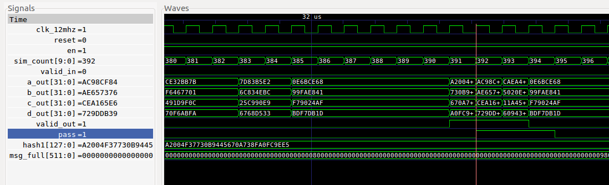

# md5core_tb

## Description

A testbench for the md5core module.  The testbench
uses iverilog and gtkwave.  It has a Makefile which has
the following targets:

* __compile__ : Default target. Compiles without running the simulation.  Good way to
  test for syntax errors.
* __run__ : Runs the simulation. Outputs PASS or FAIL to standard out.
  Generates a waveform vcd file.
* __view__ : Runs gtkwave and displays the waveform.
* __clean__ : Remove the generated files
* __help__ : Displays iverilog help

## Output

```
> make run
...
vvp md5core.vvp
VCD info: dumpfile md5core.vcd opened for output.
msg1 PASS
msg2 PASS
msg3 PASS
```

```
> make view
```




